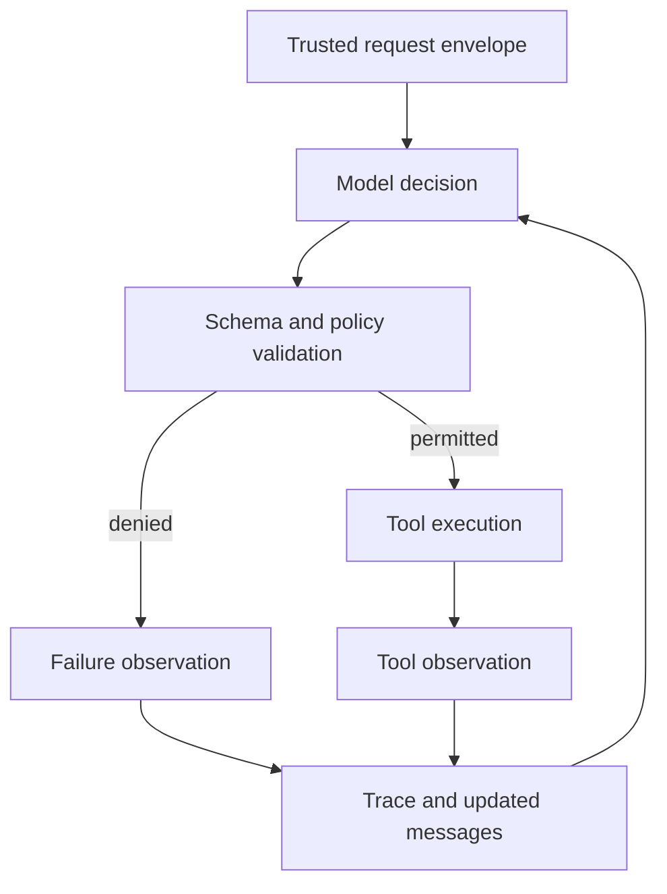

# Architecture Guide

## The interaction between the AI Model and the rest of your application

The primary objective in this project is to implement a rigid 
boundary between outputs generated by the LLM and the rest of the 
system. Our basic strategy is to ask the LLM to propose a typed 
decision, and then our application code decides whether a proposed 
action is safe to execute.



`ScriptedLLM` and `OpenAICompatibleLLM` implement the same `StructuredLLM` protocol. The former replays predetermined decisions for deterministic tests; the latter contacts a live inference server.

## Module map

| Module | Responsibility | Student edits? |
|---|---|---:|
| `models.py` | Trusted requests, tool observations, traces, and final responses | No |
| `retrieval.py` | Lexical search over policy passages | No |
| `simulator.py` | Resettable mutable laboratory state | No |
| `tools.py` | Typed tool arguments and dispatch | No |
| `llm.py` | `StructuredLLM`, deterministic `ScriptedLLM`, and optional live adapter | No |
| `policy_context.py` | Converts the preceding trace into reservation-policy facts | No |
| `evaluation.py` | Computes benchmark metrics | No |
| `public_benchmark.py` | Runs public scenarios with deterministic scripts | No |
| `agent_models.py` | Typed `ToolCall`, `Clarification`, and `Final` decisions | Yes |
| `prompts.py` | System instructions and initial messages | Yes |
| `agent.py` | Bounded decision–action–observation loop | Yes |
| `validation.py` | Three selected safety and consistency checks | Yes |

Read every module at least once. Normally modify only the four modules marked **Yes**.

## Important data types

### `LabRequest`

The authenticated user and any already-resolved project, resource, and interval form a trusted request envelope. The original natural-language text is preserved separately. An unresolved field is `None` and may require clarification.

### `ToolCallDecision`

A model-produced proposal naming a tool and arguments. Constructing this object does not execute the tool.

### `ToolObservation`

The application-produced result of validation or tool execution. `ok=True` denotes success. A failure carries an `error_code` and optional message.

### `TraceEvent`

One proposed tool call together with its actual observation. The trace is the authoritative record of attempted and successful actions.

### `AgentResponse`

The final user-facing status, message, citations, and claimed completed actions. It must be consistent with the trace.

## One read-only example

The model proposes:

```python
ToolCallDecision(
    kind="tool_call",
    tool="get_resource_status",
    arguments={
        "resource_id": "tensile-01",
        "start": "2026-10-15T10:00:00",
        "end": "2026-10-15T11:00:00",
    },
    reasoning_summary="Check availability and readiness.",
)
```

The application validates the arguments, dispatches the tool, creates a `ToolObservation`, records a `TraceEvent`, and includes the observation in the next model context.

## Why policy is not entirely inside the tool

`reserve_resource` enforces mechanical constraints such as resource existence, interval validity, and scheduling conflicts. It intentionally does not enforce every laboratory policy. Otherwise an unsafe agent could attempt every reservation immediately and rely on the backend to reject it.

The action gate therefore runs before the mutating tool. Hidden tests inspect attempted calls as well as final responses.

## The three student validators

1. **Request binding:** prevent substitution of the authenticated user or resolved request fields.
2. **Reservation preconditions:** deny execution when a supplied `ReservationContext` fact is false.
3. **Final-response consistency:** ensure citations and claimed actions agree with the trace.

These are ordinary Python checks over selected properties. Passing them does not prove correct behavior for every possible request; that limitation motivates the formally specified execution gate later in the course.

